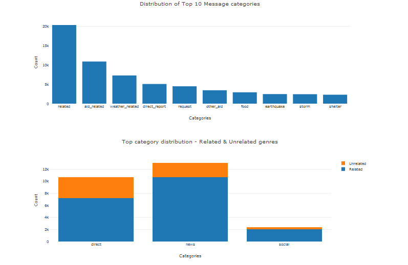
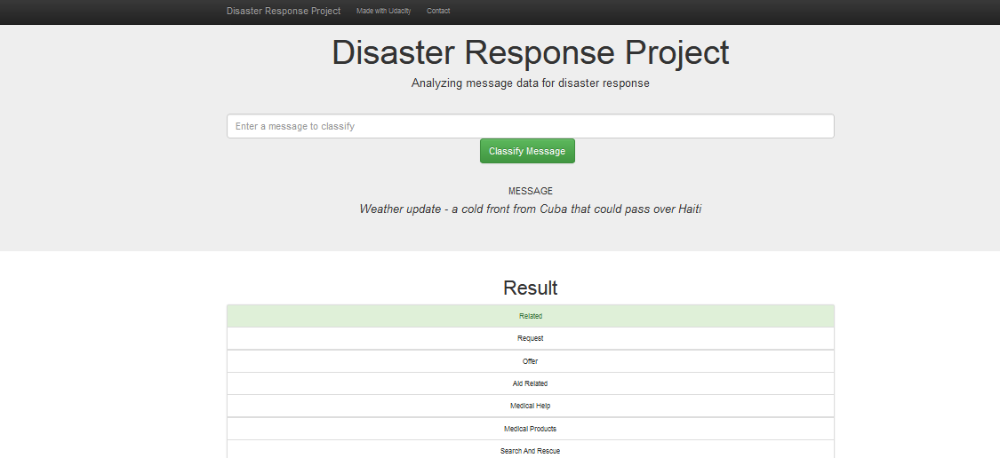

# Disaster Response Pipeline Project

## Project Overview

This project involves creation of  machine learning pipeline to classify disaster messages. The disaster messages are categoried to be sent to appropriate disaster relief agency.

The model built for an API to classify messages includes a web app where emergency worker can input messages and  get the classification outcome of the  messages. Web app also displays the visualization of the categorization of the data. Below we see a snapshot of the graphs displayed in the web app.

## Installation Requirements

    Python 3.5+ 
    Libraries: NumPy,Pandas, Scikit-learn, re, pickle
    Natural Language Process Libraries: NLTK ['punkt', 'wordnet','stopwords','averaged_perceptron_tagger']
    SQLlite Database Library: SQLAlchemy
    Web App and Data Visualization: Flask, Plotly, Json

## Summary of files

ETL Pipeline Preparation.ipynb  - Notebook to create ETL pipeline. Steps followed here is used to create database from the datasets in process_data.py, part of the web app.

ML Pipeline Preparation.ipynb  - Notebook  to create machine learning pipeline. Incorporate the steps followed here in train_classifier.py to create a database and export a model. 

Flask Web App - Web app template provided to modify file paths for database and model as needed. Additional data visualizations uses Plotly in the web app. File structure of web app.

    - app
    | - template
    | |- master.html  # main page of web app
    | |- go.html  # classification result page of web app
    |- run.py  # Flask file that runs app

    - data
    |- disaster_categories.csv  # data to process 
    |- disaster_messages.csv  # data to process
    |- process_data.py
    |- InsertDatabaseName.db   # database to save clean data to

    - models
    |- train_classifier.py
    |- classifier.pkl  # saved model 

    - README.md

## Instructions
1. Run the following commands in the project's root directory to set up database and model.

    - To run ETL pipeline that cleans data and stores in database
        `python data/process_data.py data/disaster_messages.csv data/disaster_categories.csv data/DisasterResponse.db`
    - To run ML pipeline that trains classifier and saves
        `python models/train_classifier.py data/DisasterResponse.db models/classifier.pkl`

2. Run the following command in the app's directory to run your web app.
    `python run.py`

3. Go to http://0.0.0.0:3001/

## Web app Screenshots

## Acknowledgements

Disaster Response Pipeline Project has been completed as part of Udacity Data Scientist Nanodegre. Data from [Figure Eight](https://www.figure-eight.com/) and code templates have been provided by Udacity.
